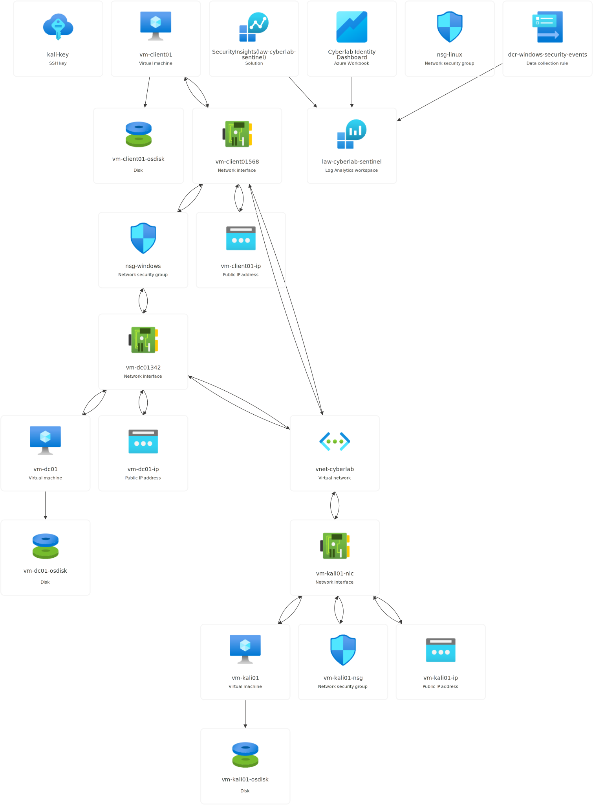

# Azure Cybersecurity Lab

> A six-phase Microsoft Azure cybersecurity lab covering Active Directory, hybrid identity, endpoint management, SIEM detection engineering, and adversary emulation. End-to-end: built the infrastructure, wrote the detections, attacked the environment from a Kali box on the same network, validated every rule against real attack data, and rebuilt two of them after the validation phase exposed production-relevant gaps.



---

## What this lab demonstrates

The lab progressed from "I built a SIEM" to "I purple-teamed my own SIEM, broke it intentionally, fixed what I found, and documented every lesson."

A single user identity (`jsmith`) created in PowerShell on the on-prem Domain Controller authenticates across on-prem domain logon, Microsoft 365 cloud services, and managed device enrollment. A single endpoint (`vm-client01`) is simultaneously domain-joined, registered to Entra via Workplace Join (the lab skipped device sync, so the device is registered rather than fully Hybrid Azure AD Joined), EDR-managed by Microsoft Defender for Endpoint, and MDM-managed by Microsoft Intune — closely mirroring the hybrid endpoint architecture most enterprises operate today.

On top of that hybrid identity environment, Microsoft Sentinel ingests three data sources (Entra sign-in/audit logs, Windows Security Events via Azure Monitor Agent and Data Collection Rules, and Defender for Endpoint alerts) and runs five custom KQL detection rules covering brute force, privilege escalation, anomalous admin behavior, on-prem account lockout, and 3-table EDR-to-identity correlation. Every rule was validated against real attack traffic from a Kali Linux machine on the same virtual network — and two of them needed substantial re-engineering once the real attack data revealed what the original detection logic missed.


---

## Phases at a glance

| Phase | Focus | Key deliverables |
|-------|-------|------------------|
| **1** | Foundation | Azure resource group, VNet, two NSGs, three VMs, cost guardrails |
| **2** | Active Directory | `cyberlab.local` domain, OU/user/group structure, baseline GPOs |
| **3** | Hybrid Identity & Endpoint | Entra Connect Sync (PHS), Conditional Access with MFA, Intune MDM, Defender for Endpoint onboarding |
| **4** | SIEM & Detection Engineering | Sentinel deployment, 3 data connectors, 5 KQL detection rules, authentication telemetry Workbook |
| **5** | Adversary Emulation & Validation | Nmap recon, Hydra RDP brute force, cloud sign-in burst, privileged role escalation, EICAR EDR alert generation |
| **6** | Portfolio | This repository |

**For the full technical narrative, design decisions, engineering findings, and reflections, read [`docs/notes.md`](docs/notes.md).**

---

## Detection rules

All five rules are committed as annotated `.kql` files. Each rule's header documents the threat being detected, the KQL logic, MITRE ATT&CK mapping, false-positive controls, and an analyst response playbook.

| # | Rule | MITRE ATT&CK | Severity | What it catches |
|---|------|--------------|----------|-----------------|
| 01 | [Failed Sign-In Burst](kql-queries/01-failed-login-burst.kql) | T1110 — Brute Force | Medium | 5+ Entra sign-in failures from one user within a 5-minute fixed time bucket |
| 02 | [New Privileged Role Assignment](kql-queries/02-new-privileged-role.kql) | T1098 — Account Manipulation | High | Admin role granted to any user, including PIM eligible assignments |
| 03 | [Off-Hours Admin Sign-In](kql-queries/03-off-hours-admin-signin.kql) | T1078 — Valid Accounts | Low | Successful sign-in outside business hours by accounts with "admin"/"adm" in the UPN |
| 04 | [Windows Account Lockout](kql-queries/04-account-lockout.kql) | T1110 — Brute Force | Medium | On-prem Event ID 4740 on the Domain Controller |
| 05 | [Defender Alert + Sign-In Correlation](kql-queries/05-defender-alert-correlation.kql) | Multi-tactic | Medium | 3-table host-bridged correlation: Defender alert → host logon → cloud sign-in |

Two rules failed initial validation against real attack traffic and were rebuilt:

- **Rule 2** originally filtered on `OperationName == "Add member to role"` and returned zero results during validation. Root cause: M365 E5 includes Entra ID P2, which routes privileged role assignments through PIM with different `OperationName` values. Expanded to `has_any(...)` covering direct active and PIM eligible operations.
- **Rule 5** originally joined `SecurityAlert` directly with `SigninLogs` on `EntityType = "account"`. Returned zero rows during EICAR validation. Root cause: Defender file/process/host alerts don't carry account entities — only file, process, and host. Rebuilt as a 3-table correlation using `SecurityEvent` (EventID 4624) as a host-to-user bridge.

Both findings are the kind that ship to production unnoticed if you don't validate against real attack data.

---

## Adversary emulation

Every detection rule was exercised against live attack traffic from `vm-kali01` on the same virtual network. Attack scenarios included:

- **Reconnaissance** — Nmap port scan and service version detection against the Domain Controller
- **On-prem brute force** — Hydra against RDP with a 10-password list including the real password
- **Cloud-side credential burst** — six sequential failed sign-ins via the M365 portal from InPrivate browser
- **Privilege escalation** — Privileged Role Administrator granted to a non-admin user via the Entra portal
- **EDR alert generation** — EICAR test file write via PowerShell, triggering Defender quarantine and full process-tree forensics

Phase 2's GPO lockout policy contained the Hydra attack even though the wordlist contained the correct password — the account locked at attempt 5, and every subsequent attempt (including the real password) was rejected at the locked-account layer. Defense-in-depth working as designed.

Full attack documentation, detection rule responses, and engineering findings are in [`docs/notes.md`](docs/notes.md#phase-5-attack-simulation-and-detection-validation).

---

## Tech stack

**Cloud platform**
- Microsoft Azure (West US 2)
- 1 Resource Group, 1 Virtual Network, 2 NSGs, 3 VMs (Windows Server 2022 DC, Windows 11 Enterprise client, Kali Linux)

**Identity**
- Active Directory Domain Services (`cyberlab.local`)
- Microsoft Entra ID with Microsoft Entra Connect Sync (Password Hash Sync + writeback)
- Conditional Access with MFA enforcement and break-glass exclusions

**Endpoint**
- Microsoft Defender for Endpoint (local-script onboarding)
- Microsoft Intune MDM with Settings catalog policy

**SIEM and detection**
- Microsoft Sentinel on Log Analytics Workspace
- Azure Monitor Agent + Data Collection Rules
- KQL across `SigninLogs`, `AuditLogs`, `SecurityEvent`, `SecurityAlert`
- 1 GB/day ingestion cap as cost guardrail

**Adversary tooling**
- Kali Linux with Hydra, Nmap
- EICAR for EDR alert generation

---

## Skills demonstrated

- Azure resource provisioning and network segmentation
- Active Directory administration: dcpromo, OU design, GPO authoring, lockout policy tuning
- Hybrid identity architecture: Entra Connect Sync, PHS vs PTA trade-offs, selective OU filtering
- Conditional Access policy design with break-glass exclusions
- Microsoft Defender for Endpoint and Microsoft Intune deployment
- Microsoft Sentinel deployment with cost protection (ingestion caps, common-tier event collection)
- KQL detection engineering: multi-table joins, identity normalization across hybrid telemetry, time-windowed correlation
- Detection rule lifecycle: design, deploy, validate, suppress, tune
- Adversary emulation from Kali: reconnaissance, brute force, privilege escalation, EDR alert generation
- Real-world rule debugging: schema inspection, diagnostic queries, root-cause analysis
- Operational discipline: cost guardrails, auto-shutdown, public IP rotation handling, license-scope troubleshooting

---

## Repository structure

```
.
├── README.md                  This document
├── architecture/
│   └── rg-cyberlab.svg        Lab architecture diagram (sanitized Azure resource export)
├── docs/
│   └── notes.md               Full technical narrative — design decisions, findings, reflections
├── kql-queries/               Five custom Sentinel analytics rules with annotated logic
│   ├── 01-failed-login-burst.kql
│   ├── 02-new-privileged-role.kql
│   ├── 03-off-hours-admin-signin.kql
│   ├── 04-account-lockout.kql
│   └── 05-defender-alert-correlation.kql
└── screenshots/               Evidence captures per phase (redacted)
```

---

## What's next

This repository documents the lab as it stands. Continued work is tracked separately:

- **Microsoft SC-200 (Security Operations Analyst)** certification — builds directly on the Sentinel, Defender, KQL, and incident response work in this lab
- **Microsoft Applied Skills: Configure SIEM security operations using Microsoft Sentinel** — practical assessment that maps to the work in Phases 4 and 5
- Additional detection coverage for token-based attacks, non-interactive sign-in monitoring, and network-layer reconnaissance

---
---

## Contact & More

- **LinkedIn:** [Abenezer Birri](https://www.linkedin.com/in/abenezer-birri/)
- **GitHub:** [@abenezerbirri](https://github.com/abenezerbirri)
- Questions? Open an [Issue](https://github.com/abenezerbirri/azure-cybersecurity-lab/issues)

*Built by [Abenezer Birri](https://github.com/abenezerbirri) — feedback and questions welcome via [Issues](https://github.com/abenezerbirri/azure-cybersecurity-lab/issues).*
